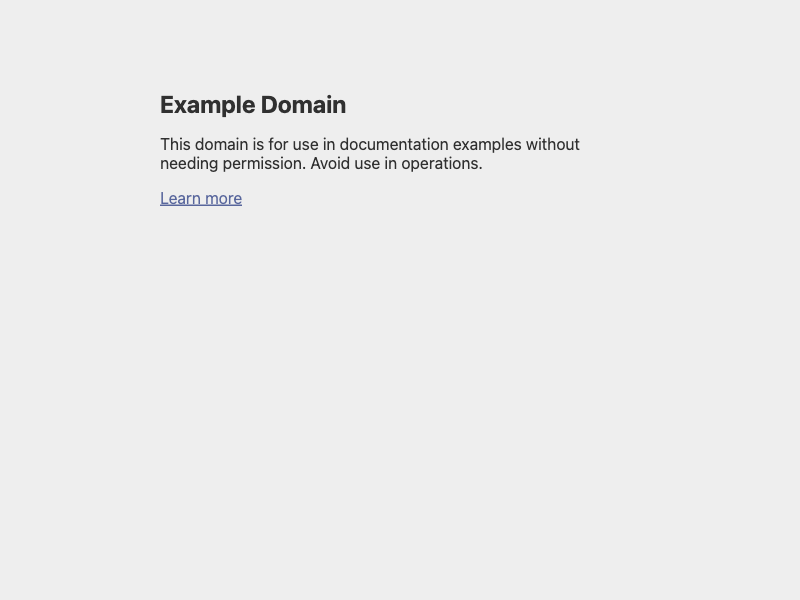
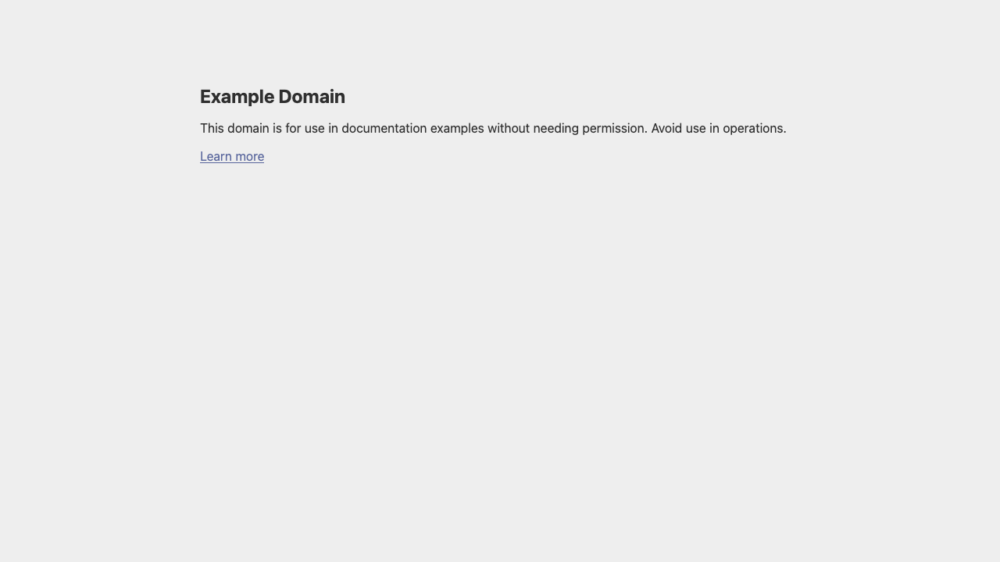
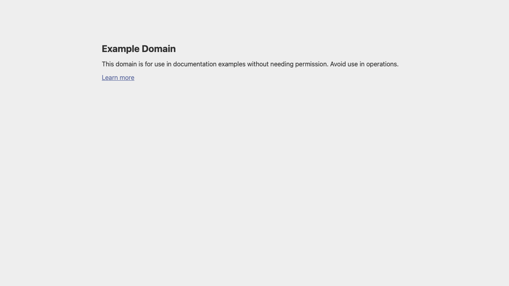

# OneCrawl E2E Benchmark Report

**Date:** 2026-03-03T15:29:17+0100
**Platform:** macOS aarch64 (Apple Silicon)
**Build:** Release mode (optimized)

---

## Executive Summary

Chromiumoxide (native CDP) is **7× faster at launch** and **18× faster at navigation** than Playwright-rs Chromium. All 6 stealth patches verified working. All subsystems (crypto, parser, storage) operational.

---

## Browser Engine Comparison

### Launch Time (cold start)

| Engine | Launch (ms) | vs Chromiumoxide |
|--------|------------|-----------------|
| **Chromiumoxide (CDP)** | **616** | **baseline** |
| Playwright Chromium | 4312 | 7.0× slower |
| Playwright Firefox | 2899 | 4.7× slower |
| Playwright WebKit | 8067 | 13.1× slower |

### Navigation (example.com)

| Engine | Nav (ms) | vs Chromiumoxide |
|--------|---------|-----------------|
| **Chromiumoxide (CDP)** | **24** | **baseline** |
| Playwright Firefox | 139 | 5.8× slower |
| Playwright WebKit | 171 | 7.1× slower |
| Playwright Chromium | 429 | 17.9× slower |

### Screenshot

| Engine | Screenshot (ms) | Size (bytes) |
|--------|----------------|-------------|
| Playwright WebKit | 15 | 32499 |
| Playwright Firefox | 35 | 30777 |
| **Chromiumoxide (CDP)** | **40** | **16589** |
| Playwright Chromium | 43 | 16578 |

> Screenshot times are comparable across engines. Chromiumoxide produces the smallest files.

---

## Stealth Verification

| Check | Result |
|-------|--------|
| `navigator.webdriver` | ✅ `false` |
| `chrome.runtime` | ✅ `object` |
| `navigator.plugins.length > 0` | ✅ `true` |
| `navigator.platform` | ✅ `Win32` (spoofed) |
| `navigator.hardwareConcurrency` | ✅ `8` (spoofed) |
| `navigator.deviceMemory` | ✅ `4` (spoofed) |

**6/6 stealth patches verified** — injection took 1ms.

---

## Crypto Performance (1000 iterations)

| Operation | Avg Time | Notes |
|-----------|---------|-------|
| Encrypt (AES-256-GCM) | 9148μs | PBKDF2 key derivation per call |
| Decrypt (AES-256-GCM) | 9329μs | PBKDF2 key derivation per call |
| PKCE Challenge | 1μs | Instant |
| TOTP Generation | 21μs | HMAC-SHA1 based |

---

## Parser Performance

| Operation | Time | Details |
|-----------|------|---------|
| Accessibility Tree | 338μs | Full DOM → A11y tree |
| Query Selector | 49μs | 5 matches found |
| Extract Text | 14μs | 3 text nodes |
| Extract Links | 17μs | 4 links |

---

## Storage Performance (100 iterations, encrypted sled)

| Operation | Avg Time | Notes |
|-----------|---------|-------|
| Write | 10.8ms | AES-256-GCM encrypted |
| Read | 11.6ms | Decrypt on read |
| List | 204μs | Prefix scan |

---

## Recommendation

**Primary engine: Chromiumoxide (native CDP)** — 7× faster launch, 18× faster navigation, full stealth support, smallest binary footprint. Use Playwright-rs only for cross-browser testing (Firefox/WebKit).

---

## Screenshots

### Chromiumoxide — example.com

### Chromiumoxide — Stealth Patched

### Playwright-rs — Chromium

### Playwright-rs — Firefox

### Playwright-rs — WebKit

