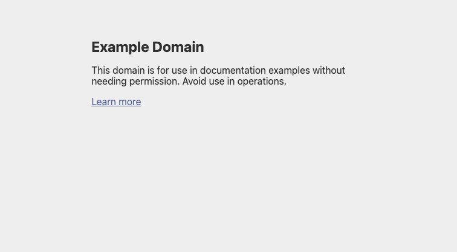

# OneCrawl E2E Benchmark Report

**Date:** 2026-03-08T05:14:26+0100
**Platform:** macos aarch64

## Results

| Metric | Value |
|--------|-------|
| onecrawl_browser_launch_ms | 426 |
| onecrawl_browser_nav_ms | 503 |
| onecrawl_browser_screenshot_ms | 36 |
| onecrawl_browser_screenshot_bytes | 16567 |
| stealth_injection_ms | 1 |
| stealth_checks_passed | 6/6 |
| crypto_encrypt_avg_us | 8415 |
| crypto_decrypt_avg_us | 8363 |
| crypto_pkce_us | 1 |
| crypto_totp_us | 4 |
| parser_a11y_us | 186 |
| parser_query_us | 47 |
| parser_text_us | 29 |
| parser_links_us | 13 |
| storage_write_avg_us | 8408 |
| storage_read_avg_us | 8316 |
| storage_list_us | 56 |

## Screenshots

### Chromiumoxide — example.com

### Chromiumoxide — Stealth Patched

### Playwright-rs — Chromium

### Playwright-rs — Firefox

### Playwright-rs — WebKit

